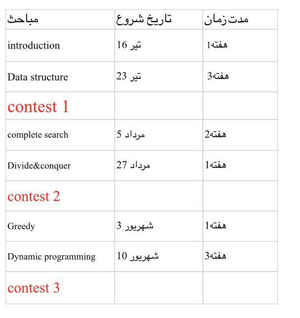

## IUT ACM Chapter *Introduction to **Problem Solving and ICPC** Program*, Summer 2018

This repo contains all materials used for summer 2018 program held by IUT ACM Student Chapter.

### Program Goals:
* Discuss Importance of problem solving ability
* Introduction to standard resources available
* Educational topics for all summer
* Regular contests

### Precise program dates:

### Thanks to
* TODO
